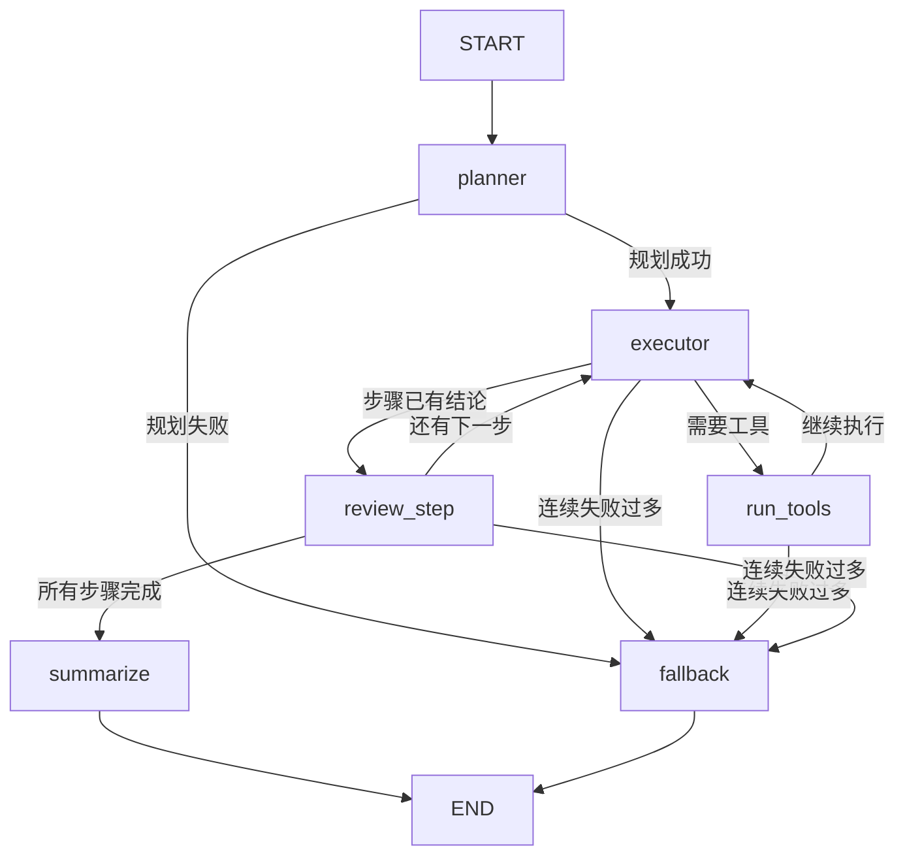

# 构建第一个 DeepAgent：规划、执行与结果汇总的单智能体闭环

很多人第一次写 Agent，做到“模型能调工具”就停了。但这离真正可用的 `DeepAgent` 还差一截。一个能处理复杂任务的单智能体，至少要形成完整闭环：

- 先拆任务，生成计划
- 再按计划推进执行
- 需要外部信息时调工具
- 把工具结果回填进运行状态
- 在每一步结束时检查是否收敛
- 最后汇总成面向用户的结果
- 中间失败时还能重试或降级

这篇文章就围绕这一条链路，带你用 `LangGraph` 搭一个“真正像样”的第一个 DeepAgent。它不是多智能体系统，只有一个 agent 角色，但已经具备 `Planner + Executor + Tool Loop + Summary + Fallback` 的完整运行骨架。

## 一、先明确：单智能体闭环到底在解决什么

“单智能体”不等于“只调一次模型”。

在复杂任务里，真正难的通常不是生成一句答案，而是持续推进任务。比如用户说：

> 请为博客后台的文章批量发布功能输出一份上线执行摘要，包含背景、关键风险、实施步骤和时间预估。

这类任务通常不适合一把梭回答，因为它天然包含几个阶段：

1. 识别任务目标和交付物
2. 拆成多个可执行步骤
3. 逐步收集信息
4. 判断当前步骤是否已经够用
5. 输出最终摘要

如果没有状态、路由和回环，Agent 很容易出现几个典型问题：

- 一开始就直接写最终答案，跳过信息收集
- 工具调完以后，没有把结果结构化存下来
- 某一步失败时，不知道应该重试、继续还是降级
- 运行结束后只有一段自然语言，看不到过程产物

DeepAgent 的关键价值，不在于“会不会调工具”，而在于“能不能把复杂任务稳定推进到结束”。

## 二、案例目标：把复杂需求变成一条可运行闭环

这次我们用一个很具体的案例来做：

> 输入一个复杂产品任务，让单智能体自动拆步骤，按步骤决定是否调用工具，回填工具结果，逐步形成中间结论，最后输出一份完整的上线执行摘要。

为了把重点放在 `LangGraph` 图本身，而不是外部 API 集成，这个示例故意使用了 3 个本地工具：

- `project_search`：搜索项目知识库，补背景与依赖
- `risk_lookup`：查询风险手册，补失败模式与缓解策略
- `effort_estimator`：估算粗粒度工作量

这样做的好处是，代码结构和真实 Agent 一样，但你不需要额外准备数据库、搜索服务或内部系统。

## 三、先把图画出来

这个单智能体图可以先用一张图看清楚：



这张图里最重要的不是节点名字，而是控制语义：

- `planner` 负责把任务拆成步骤
- `executor` 只处理当前步骤，决定是继续思考还是调工具
- `run_tools` 执行工具，并把结果回填到状态
- `review_step` 判断当前步骤是否完成，并推进到下一步
- `summarize` 汇总最终答案
- `fallback` 在连续失败时输出降级结果

这就是一个最小但完整的 DeepAgent 闭环。

## 四、状态怎么设计，决定了图能不能长大

单智能体闭环是否稳定，核心不在 prompt 有多长，而在 `State` 是否清晰。这个例子里的状态结构分成 5 类：

| 状态字段 | 作用 |
| --- | --- |
| `user_task`、`delivery_target` | 原始任务和最终交付目标 |
| `plan`、`current_step` | 当前的整体计划和执行位置 |
| `loop_messages`、`pending_tool_calls` | 当前步骤内部的执行上下文和待执行工具 |
| `evidence`、`step_drafts` | 工具证据和各步骤中间结论 |
| `error_count`、`last_error`、`status` | 失败恢复和路由控制 |

这里有两个设计点很重要。

### 1. 工具结果不能只留在 Message 里

如果工具回包只存在 `ToolMessage` 里，模型下一步也许能看见，但你的系统很难：

- 审计到底收集了哪些事实
- 在下一步重用同一份证据
- 在失败降级时输出“目前已经知道什么”

所以这个示例会把工具输出同时写到 `evidence` 字段里。  
这就是“工具调用结果回填”的核心。

### 2. 当前步骤上下文和全局中间产物要分开

`loop_messages` 只服务于“当前步骤内部的对话循环”，当步骤完成后就清空。  
而 `step_drafts` 和 `evidence` 则是跨步骤保留的全局产物。

这样设计可以避免一个常见问题：越跑上下文越脏，最后模型开始被旧步骤噪音干扰。

## 五、依赖与运行前准备

这个示例用 Python 3.11+，依赖如下：

```bash
uv add langgraph langchain langchain-openai pydantic python-dotenv
```

准备一个 `.env`：

```dotenv
OPENAI_API_KEY=your_api_key_here
OPENAI_MODEL=gpt-5.5
OPENAI_BASE_URL=
```

说明：

- `OPENAI_MODEL` 填你实际可用、支持工具调用的模型
- `OPENAI_BASE_URL` 可选；如果你使用兼容 OpenAI 接口的平台，再填写它

## 六、完整代码：一个真正能闭环跑起来的单智能体

下面是完整示例。建议你先完整看一遍，再回头对照节点讲解。

```python
from __future__ import annotations

import json
import operator
import os
from typing import Annotated, Any, Literal

from pydantic import BaseModel, Field
from typing_extensions import TypedDict

from langchain_core.messages import AIMessage, BaseMessage, HumanMessage, ToolMessage
from langchain_core.tools import BaseTool, tool
from langchain_openai import ChatOpenAI
from langgraph.checkpoint.memory import InMemorySaver
from langgraph.graph import END, START, StateGraph

PROJECT_KB = {
    "批量发布": [
        "功能目标：允许编辑在后台一次性发布多篇已审核文章。",
        "依赖项：文章状态机、定时发布任务和审核日志需要协同工作。",
        "已知约束：必须避免重复发布，并保留单篇回滚能力。",
    ],
    "审核流": [
        "批量发布只能处理已审核通过的文章。",
        "审核记录必须可追溯，否则无法定位误发布来源。",
    ],
    "后台运营": [
        "运营团队希望减少手工逐篇点击发布的时间成本。",
        "高峰期常见诉求是预约发布时间和失败重试。",
    ],
}

RISK_KB = {
    "发布": [
        "风险：定时任务重复触发导致重复上线。缓解：增加幂等键与发布锁。",
        "风险：批量任务部分成功、部分失败。缓解：记录逐篇状态并支持补偿重试。",
    ],
    "回滚": [
        "风险：批量回滚影响已手工修订的文章。缓解：回滚前校验版本号与修改时间。",
    ],
    "审核": [
        "风险：未审核文章混入批量任务。缓解：执行前强校验文章状态。",
    ],
}


class PlanStep(BaseModel):
    id: str = Field(description="步骤 ID，例如 step-1")
    title: str = Field(description="步骤标题")
    objective: str = Field(description="该步骤要完成的目标")
    suggested_tool: Literal["project_search", "risk_lookup", "effort_estimator", "none"]
    done_when: str = Field(description="这一步何时算完成")


class PlannerOutput(BaseModel):
    steps: list[PlanStep] = Field(min_length=2, max_length=4)
    final_deliverable: str = Field(description="最终面向用户的交付物说明")


class AgentState(TypedDict):
    user_task: str
    delivery_target: str
    plan: list[dict[str, Any]]
    current_step: int
    loop_messages: list[BaseMessage]
    pending_tool_calls: list[dict[str, Any]]
    evidence: Annotated[list[dict[str, Any]], operator.add]
    step_drafts: Annotated[list[dict[str, str]], operator.add]
    last_step_output: str
    final_answer: str
    status: Literal["planning", "executing", "summarizing", "done", "fallback"]
    error_count: int
    max_error_count: int
    last_error: str | None
    logs: Annotated[list[str], operator.add]


@tool
def project_search(query: str) -> str:
    """搜索项目知识库，适合查功能背景、依赖和已有约束。"""
    query_lower = query.lower()
    hits: list[str] = []

    for keyword, items in PROJECT_KB.items():
        if keyword in query or keyword.lower() in query_lower:
            hits.extend(items)

    if not hits:
        hits = [
            "没有直接命中项目知识库，请缩短关键词后重试。",
            "可尝试的关键词：批量发布、审核流、后台运营。",
        ]

    return "\n".join(f"- {item}" for item in hits[:4])


@tool
def risk_lookup(topic: str) -> str:
    """查询风险与缓解手册，适合补充失败模式、补偿和防护措施。"""
    topic_lower = topic.lower()
    hits: list[str] = []

    for keyword, items in RISK_KB.items():
        if keyword in topic or keyword.lower() in topic_lower:
            hits.extend(items)

    if not hits:
        hits = ["没有直接命中风险手册，请尝试发布、回滚、审核等关键词。"]

    return "\n".join(f"- {item}" for item in hits[:4])


@tool
def effort_estimator(
    scope: str,
    engineer_count: int,
    complexity: Literal["low", "medium", "high"] = "medium",
) -> str:
    """估算粗粒度研发工作量，输出总人天与并行建议。"""
    base_days = {"low": 2.0, "medium": 4.0, "high": 7.0}[complexity]
    multiplier = 1.0

    if "测试" in scope:
        multiplier += 0.5
    if "回滚" in scope or "幂等" in scope:
        multiplier += 0.5
    if "审核" in scope:
        multiplier += 0.5

    total_days = round(base_days * multiplier, 1)
    per_engineer_days = round(total_days / max(engineer_count, 1), 1)

    return (
        f"粗估总工作量 {total_days} 人天；"
        f"按 {engineer_count} 名工程师并行，人均约 {per_engineer_days} 天。"
        f" 假设复杂度={complexity}，范围={scope}。"
    )


TOOLS: list[BaseTool] = [project_search, risk_lookup, effort_estimator]
TOOLS_BY_NAME = {tool.name: tool for tool in TOOLS}


def build_model() -> ChatOpenAI:
    kwargs: dict[str, Any] = {
        "model": os.getenv("OPENAI_MODEL", "gpt-5.5"),
        "api_key": os.environ["OPENAI_API_KEY"],
        "temperature": 0,
    }
    base_url = os.getenv("OPENAI_BASE_URL")
    if base_url:
        kwargs["base_url"] = base_url
    return ChatOpenAI(**kwargs)


def content_to_text(content: Any) -> str:
    if isinstance(content, str):
        return content
    if isinstance(content, list):
        parts: list[str] = []
        for block in content:
            if isinstance(block, str):
                parts.append(block)
                continue
            if isinstance(block, dict):
                text = block.get("text")
                if text:
                    parts.append(str(text))
        return "\n".join(part for part in parts if part)
    return str(content)


def extract_json_object(text: str) -> str:
    start = text.find("{")
    end = text.rfind("}")
    if start == -1 or end == -1 or end < start:
        raise ValueError(f"无法从模型输出中提取 JSON: {text}")
    return text[start : end + 1]


def render_plan(plan: list[dict[str, Any]]) -> str:
    if not plan:
        return "暂无计划"

    lines: list[str] = []
    for step in plan:
        lines.append(
            f"{step['id']}: {step['title']} | 目标={step['objective']} | "
            f"建议工具={step['suggested_tool']} | 完成条件={step['done_when']}"
        )
    return "\n".join(lines)


def render_evidence(items: list[dict[str, Any]]) -> str:
    if not items:
        return "暂无证据"

    chunks: list[str] = []
    for item in items:
        chunks.append(
            f"[{item['step_id']}] {item['tool_name']}({json.dumps(item['tool_input'], ensure_ascii=False)})\n"
            f"{item['tool_output']}"
        )
    return "\n\n".join(chunks)


def render_step_drafts(step_drafts: list[dict[str, str]]) -> str:
    if not step_drafts:
        return "暂无步骤结论"
    return "\n\n".join(
        f"[{item['step_id']}] {item['title']}\n{item['summary']}" for item in step_drafts
    )


def current_step_model(state: AgentState) -> PlanStep:
    return PlanStep.model_validate(state["plan"][state["current_step"]])


def build_graph() -> Any:
    model = build_model()
    executor_model = model.bind_tools(TOOLS)

    def planner_node(state: AgentState) -> dict[str, Any]:
        prompt = f"""
你是 DeepAgent 的 Planner。
请把下面的复杂任务拆成 2 到 4 个顺序步骤。
每个步骤都必须包含：
- id: 使用 step-1、step-2 这种格式
- title: 6 到 12 个中文字符
- objective: 这一步要拿到什么结果
- suggested_tool: 只能是 project_search、risk_lookup、effort_estimator、none
- done_when: 这一步何时可以收敛

只输出 JSON 对象，不要输出 Markdown，不要解释。
输出格式：
{{
  "steps": [
    {{
      "id": "step-1",
      "title": "示例标题",
      "objective": "示例目标",
      "suggested_tool": "project_search",
      "done_when": "示例完成条件"
    }}
  ],
  "final_deliverable": "最终要交付给用户的内容说明"
}}

用户任务：
{state['user_task']}
""".strip()

        try:
            response = model.invoke(prompt)
            planner_output = PlannerOutput.model_validate_json(
                extract_json_object(content_to_text(response.content))
            )
        except Exception as exc:
            return {
                "status": "fallback",
                "last_error": f"规划失败: {exc}",
                "logs": [f"planner -> failed: {exc}"],
            }

        return {
            "delivery_target": planner_output.final_deliverable,
            "plan": [step.model_dump() for step in planner_output.steps],
            "current_step": 0,
            "status": "executing",
            "last_error": None,
            "logs": [f"planner -> created {len(planner_output.steps)} steps"],
        }

    def executor_node(state: AgentState) -> dict[str, Any]:
        step = current_step_model(state)
        step_evidence = [item for item in state["evidence"] if item["step_id"] == step.id]

        prompt = f"""
你是 DeepAgent 的 Executor，现在只处理当前步骤。

用户总任务：
{state['user_task']}

最终交付目标：
{state['delivery_target']}

完整计划：
{render_plan(state['plan'])}

当前步骤：
- id: {step.id}
- title: {step.title}
- objective: {step.objective}
- suggested_tool: {step.suggested_tool}
- done_when: {step.done_when}

当前步骤已有证据：
{render_evidence(step_evidence)}

最近一次错误：
{state['last_error'] or '无'}

执行规则：
1. 如果信息不够，就调用工具补信息。
2. 如果信息已经足够，就直接输出“当前步骤的结论”，不要写最终答案。
3. 不要跳到下一个步骤。
4. 工具报错时，结合 ToolMessage 修正参数后再试。
""".strip()

        input_messages: list[BaseMessage] = [HumanMessage(content=prompt), *state["loop_messages"]]
        ai_message = executor_model.invoke(input_messages)
        output_text = content_to_text(ai_message.content).strip()

        update: dict[str, Any] = {
            "loop_messages": [*state["loop_messages"], ai_message],
            "pending_tool_calls": ai_message.tool_calls,
            "last_step_output": output_text,
            "logs": [
                f"executor -> step={step.id}, tool_calls={len(ai_message.tool_calls)}, has_text={bool(output_text)}"
            ],
        }

        if not ai_message.tool_calls and not output_text:
            update["error_count"] = state["error_count"] + 1
            update["last_error"] = f"{step.id} 没有产出可用结果"

        return update

    def run_tools_node(state: AgentState) -> dict[str, Any]:
        step = current_step_model(state)
        loop_messages = list(state["loop_messages"])
        evidence: list[dict[str, Any]] = []
        error_count = state["error_count"]
        last_error = state["last_error"]

        for tool_call in state["pending_tool_calls"]:
            tool_name = tool_call["name"]
            tool_obj = TOOLS_BY_NAME.get(tool_name)

            if tool_obj is None:
                error_count += 1
                last_error = f"未注册工具: {tool_name}"
                loop_messages.append(
                    ToolMessage(
                        content=last_error,
                        tool_call_id=tool_call["id"],
                        name=tool_name,
                    )
                )
                continue

            try:
                raw_output = tool_obj.invoke(tool_call["args"])
                tool_output = raw_output if isinstance(raw_output, str) else json.dumps(raw_output, ensure_ascii=False)
                loop_messages.append(
                    ToolMessage(
                        content=tool_output,
                        tool_call_id=tool_call["id"],
                        name=tool_name,
                    )
                )
                evidence.append(
                    {
                        "step_id": step.id,
                        "tool_name": tool_name,
                        "tool_input": tool_call["args"],
                        "tool_output": tool_output,
                    }
                )
                error_count = 0
                last_error = None
            except Exception as exc:
                error_count += 1
                last_error = f"{tool_name} 执行失败: {exc}"
                loop_messages.append(
                    ToolMessage(
                        content=last_error,
                        tool_call_id=tool_call["id"],
                        name=tool_name,
                    )
                )

        return {
            "loop_messages": loop_messages,
            "pending_tool_calls": [],
            "evidence": evidence,
            "error_count": error_count,
            "last_error": last_error,
            "logs": [
                f"run_tools -> executed={len(state['pending_tool_calls'])}, evidence_added={len(evidence)}, error_count={error_count}"
            ],
        }

    def review_step_node(state: AgentState) -> dict[str, Any]:
        step = current_step_model(state)
        summary = state["last_step_output"].strip()

        if not summary:
            return {
                "error_count": state["error_count"] + 1,
                "last_error": f"{step.id} 缺少步骤结论，回到执行器继续补全",
                "logs": [f"review_step -> retry {step.id}"],
            }

        next_step = state["current_step"] + 1
        next_status: Literal["executing", "summarizing"] = (
            "summarizing" if next_step >= len(state["plan"]) else "executing"
        )

        return {
            "step_drafts": [
                {
                    "step_id": step.id,
                    "title": step.title,
                    "summary": summary,
                }
            ],
            "current_step": next_step,
            "loop_messages": [],
            "last_step_output": "",
            "status": next_status,
            "error_count": 0,
            "last_error": None,
            "logs": [f"review_step -> complete {step.id}, next={next_status}"],
        }

    def summarize_node(state: AgentState) -> dict[str, Any]:
        prompt = f"""
你是 DeepAgent 的 Summarizer。
请基于已有步骤结论和工具证据，输出最终交付物。

用户任务：
{state['user_task']}

最终交付目标：
{state['delivery_target']}

步骤结论：
{render_step_drafts(state['step_drafts'])}

关键证据：
{render_evidence(state['evidence'])}

输出要求：
1. 先给结论。
2. 必须包含：背景与约束、关键风险、执行建议、时间预估。
3. 不要暴露内部思考，不要提“步骤 1/步骤 2”。
""".strip()

        try:
            response = model.invoke(prompt)
            final_answer = content_to_text(response.content).strip()
            if not final_answer:
                raise ValueError("总结节点返回空内容")
        except Exception as exc:
            final_answer = (
                "进入降级总结，因为最终汇总失败。\n\n"
                f"最近错误：{exc}\n\n"
                "已完成的步骤结论：\n"
                f"{render_step_drafts(state['step_drafts'])}"
            )
            return {
                "final_answer": final_answer,
                "status": "fallback",
                "logs": [f"summarize -> fallback: {exc}"],
            }

        return {
            "final_answer": final_answer,
            "status": "done",
            "logs": ["summarize -> done"],
        }

    def fallback_node(state: AgentState) -> dict[str, Any]:
        partial_summary = render_step_drafts(state["step_drafts"])
        evidence_summary = render_evidence(state["evidence"])
        final_answer = (
            "进入降级输出，因为执行阶段连续失败。\n\n"
            f"最近错误：{state['last_error']}\n\n"
            "目前已经拿到的步骤结论：\n"
            f"{partial_summary}\n\n"
            "目前已经收集到的证据：\n"
            f"{evidence_summary}\n\n"
            "建议：修复失败工具、缩小任务范围，或保留现有结论后重新触发该线程。"
        )
        return {
            "final_answer": final_answer,
            "status": "fallback",
            "loop_messages": [],
            "pending_tool_calls": [],
            "logs": ["fallback -> degraded answer"],
        }

    def route_after_planner(state: AgentState) -> Literal["executor", "fallback"]:
        return "fallback" if state["status"] == "fallback" else "executor"

    def route_after_executor(state: AgentState) -> Literal["run_tools", "review_step", "executor", "fallback"]:
        if state["error_count"] >= state["max_error_count"]:
            return "fallback"
        if state["pending_tool_calls"]:
            return "run_tools"
        if not state["last_step_output"].strip():
            return "executor"
        return "review_step"

    def route_after_run_tools(state: AgentState) -> Literal["executor", "fallback"]:
        if state["error_count"] >= state["max_error_count"]:
            return "fallback"
        return "executor"

    def route_after_review(state: AgentState) -> Literal["executor", "summarize", "fallback"]:
        if state["error_count"] >= state["max_error_count"]:
            return "fallback"
        if state["status"] == "summarizing":
            return "summarize"
        return "executor"

    builder = StateGraph(AgentState)
    builder.add_node("planner", planner_node)
    builder.add_node("executor", executor_node)
    builder.add_node("run_tools", run_tools_node)
    builder.add_node("review_step", review_step_node)
    builder.add_node("summarize", summarize_node)
    builder.add_node("fallback", fallback_node)

    builder.add_edge(START, "planner")
    builder.add_conditional_edges(
        "planner",
        route_after_planner,
        {
            "executor": "executor",
            "fallback": "fallback",
        },
    )
    builder.add_conditional_edges(
        "executor",
        route_after_executor,
        {
            "run_tools": "run_tools",
            "review_step": "review_step",
            "executor": "executor",
            "fallback": "fallback",
        },
    )
    builder.add_conditional_edges(
        "run_tools",
        route_after_run_tools,
        {
            "executor": "executor",
            "fallback": "fallback",
        },
    )
    builder.add_conditional_edges(
        "review_step",
        route_after_review,
        {
            "executor": "executor",
            "summarize": "summarize",
            "fallback": "fallback",
        },
    )
    builder.add_edge("summarize", END)
    builder.add_edge("fallback", END)

    return builder.compile(checkpointer=InMemorySaver())


def run_demo() -> None:
    graph = build_graph()
    initial_state: AgentState = {
        "user_task": "请为博客后台的文章批量发布功能输出一份上线执行摘要，包含背景、关键风险、实施步骤和时间预估。",
        "delivery_target": "",
        "plan": [],
        "current_step": 0,
        "loop_messages": [],
        "pending_tool_calls": [],
        "evidence": [],
        "step_drafts": [],
        "last_step_output": "",
        "final_answer": "",
        "status": "planning",
        "error_count": 0,
        "max_error_count": 3,
        "last_error": None,
        "logs": [],
    }

    config = {"configurable": {"thread_id": "single-agent-loop-demo"}}
    final_state = graph.invoke(initial_state, config=config)

    print("=== Plan ===")
    print(render_plan(final_state["plan"]))
    print("\n=== Evidence Count ===")
    print(len(final_state["evidence"]))
    print("\n=== Final Answer ===")
    print(final_state["final_answer"])
    print("\n=== Logs ===")
    for line in final_state["logs"]:
        print("-", line)


if __name__ == "__main__":
    run_demo()
```

## 七、这段代码为什么已经算是一个真正的 DeepAgent

很多初学者会把“带工具的大模型调用”和“DeepAgent”混为一谈。上面的代码之所以已经属于真正意义上的单智能体 DeepAgent，不是因为它用了 `LangGraph` 这个库名，而是因为它满足了几个关键条件。

### 1. `planner_node` 先把复杂任务变成可执行计划

先规划，而不是先回答，是第一条分水岭。

`planner_node` 做的事情是：

- 读取用户原始任务
- 让模型输出结构化步骤
- 把步骤写入 `plan`
- 把最终交付目标写入 `delivery_target`

这一步最重要的不是“步骤写得多漂亮”，而是把复杂任务从一句自然语言，转成系统可以继续消费的状态。

如果没有这一步，后面的执行器就会始终在“边想边做”的混沌状态里工作，最后很难稳定。

### 2. `executor_node` 只负责当前步骤，不碰最终答案

这是第二条关键边界。

执行器最容易犯的错，就是明明只需要补一步信息，却直接把整份答案写完。这个例子专门限制它：

- 只看当前步骤
- 信息不够就调工具
- 信息够了就只写当前步骤结论
- 不允许跳到下一个步骤

这会让整个系统更像“推进器”，而不是“一次性生成器”。

### 3. `run_tools_node` 不只是执行工具，还做结果回填

这是整篇文章最应该盯住的地方。

工具调用完成后，这个节点做了两件事：

1. 生成 `ToolMessage`，把回包放回当前步骤的对话循环
2. 追加一条 `evidence` 记录，把工具输入输出结构化存进状态

代码里最关键的就是这段：

```python
evidence.append(
    {
        "step_id": step.id,
        "tool_name": tool_name,
        "tool_input": tool_call["args"],
        "tool_output": tool_output,
    }
)
```

这就是“工具结果回填”的最小工程化实现。  
从这一刻开始，工具结果不再只是模型看过的一段文本，而是系统状态的一部分。

### 4. `review_step_node` 让图真正形成闭环

如果你只有 `planner -> executor -> run_tools -> executor`，严格来说还只是“工具循环”，还没真正闭环。

闭环的关键，是每一轮都要回答两个问题：

1. 当前步骤完成了吗
2. 如果完成了，下一步去哪

`review_step_node` 正在做这件事：

- 如果当前步骤没有产出结论，就回到执行器继续补全
- 如果已经有步骤结论，就写入 `step_drafts`
- 如果还有下一步，就推进 `current_step`
- 如果所有步骤都结束，就进入 `summarize`

也就是说，闭环不是“会循环”，而是“循环之后知道怎么收敛”。

### 5. `summarize_node` 把中间产物转成最终答案

很多 Agent 示例到工具执行就结束了，但真实业务里用户最终要的是结果，而不是过程。

总结节点会消费三类信息：

- 原始任务 `user_task`
- 步骤结论 `step_drafts`
- 工具证据 `evidence`

最后把它们汇成面向用户的最终输出。  
这一步本质上是在做“运行状态到交付结果”的最后一次编译。

## 八、失败回退策略到底怎么设计

一个能进生产的 Agent，不能只考虑成功路径。

这个例子里，失败恢复分成两层：

### 1. 轻失败：留在闭环里继续修正

例如：

- 工具参数不对
- 工具没查到结果
- 执行器这轮没产出文本

这类失败不会立刻终止，而是：

- 记录到 `last_error`
- 增加 `error_count`
- 回到 `executor`

这样模型还能结合最新 `ToolMessage` 继续改写参数或换个工具。

### 2. 重失败：退出主流程，进入 `fallback`

当 `error_count >= max_error_count` 时，路由直接切到 `fallback`。  
这个节点不会再假装“一切正常”，而是老老实实输出：

- 最近一次错误
- 目前已经拿到的步骤结论
- 目前已经收集到的证据
- 下一次重试建议

这比直接抛异常成熟得多，因为它保住了“部分可用结果”。

## 九、怎么运行这个示例

运行方式很直接：

```bash
uv run python single_agent_deepagent.py
```

你会看到 4 类输出：

1. 规划后的步骤列表
2. 累积到的证据数量
3. 最终执行摘要
4. 整条图的运行日志

一次典型运行通常会经历这样的轨迹：

1. `planner` 把任务拆成“背景收集、风险识别、工时估算、结果汇总”
2. `executor` 先为当前步骤触发 `project_search`
3. `run_tools` 把结果回填到 `evidence`
4. `executor` 基于证据写出该步骤结论
5. `review_step` 推进到下一步
6. 全部步骤完成后进入 `summarize`

如果中途某个工具连续失败三次，图不会硬崩，而是进入降级输出。

## 十、从示例到生产环境，下一步该怎么演进

上面的代码已经是一个完整闭环，但生产里通常还会继续往前走三步。

### 1. 把 Planner 改成更稳的结构化输出

这篇文章为了讲清机制，用了“JSON 提示 + Pydantic 校验”的方式。  
真实项目里可以进一步换成 provider-native structured output，减少解析失败概率。

### 2. 把手写 `run_tools_node` 升级成官方工具节点

这里手写工具执行器，是为了让你一眼看清“工具调用结果回填”到底发生在哪。  
等你理解机制以后，可以考虑替换成 `ToolNode` 或带 `Command` 更新状态的工具实现，减少样板代码。

### 3. 把 `InMemorySaver` 换成真正的持久化检查点

示例使用 `InMemorySaver`，是为了本地最小可跑。  
如果你要处理中断恢复、长任务续跑、人工介入后继续执行，就应该接入正式 checkpointer。

## 十一、这个例子最值得记住的 6 个工程结论

1. 单智能体也完全可以有多节点图，单智能体说的是“一个 agent 角色”，不是“一个函数调用”。
2. Planner 和 Executor 最好拆开，否则模型会一边规划一边偷跑执行。
3. 工具结果一定要回填到显式状态，不能只留在消息历史里。
4. 闭环的关键不是循环，而是“每一步何时完成、失败后如何继续、何时结束”。
5. 最终答案节点应该消费中间产物，而不是重新从用户问题裸生成。
6. 降级输出不是失败，而是把系统从“全有或全无”变成“部分可用”。

## 十二、总结

构建第一个 DeepAgent，最重要的不是堆多少工具，而是先把最小闭环搭起来：

- 有规划
- 有执行
- 有工具回环
- 有结果回填
- 有步骤评审
- 有最终汇总
- 有失败降级

一旦这 7 件事都在一张 `LangGraph` 图里落稳了，你写出来的就不再是“会调工具的聊天机器人”，而是一个真正能持续推进复杂任务的单智能体运行时。

下一步如果继续往前走，最自然的方向就是：

- 增加更细的工具权限控制
- 加入持久化检查点和人工介入
- 把单智能体闭环扩展成多智能体协作图

但无论你后面走多远，第一块基石几乎总是这篇文章里的结构：  
`Planner -> Executor -> Tool Loop -> Review -> Summary/Fallback`

## 参考资料

- DeepAgents Overview: https://docs.langchain.com/oss/python/deepagents/overview
- LangGraph Overview: https://docs.langchain.com/oss/python/langgraph/overview
- LangGraph Thinking in LangGraph: https://docs.langchain.com/oss/python/langgraph/thinking-in-langgraph
- LangGraph Workflows and Agents: https://docs.langchain.com/oss/python/langgraph/workflows-agents
- LangChain Tools: https://docs.langchain.com/oss/python/langchain/tools
- LangChain Structured Output: https://docs.langchain.com/oss/python/langchain/structured-output
