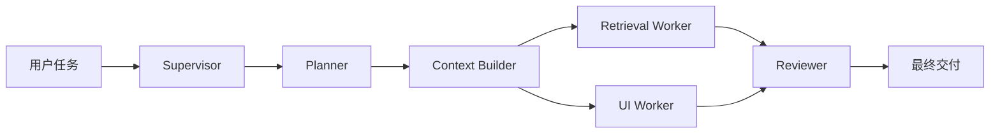

很多团队在把 Agent 从“单次对话”升级到“复杂任务执行器”时，第一反应是继续给主 Agent 加更多 prompt、更多工具、更多上下文。结果通常不是更强，而是更乱：主 Agent 同时背着规划、检索、编码、审查、汇总几个角色，token 消耗越来越高，错误定位越来越难。

DeepAgents 这类系统真正的拐点，不是“再加一个模型”，而是把任务拆成一个 `Supervisor` 和多个子 Agent，并且让每个子 Agent 只拿到完成自己任务所需的最小上下文。

这篇文章不重复入门概念，也不再讲单智能体闭环，而是直接解决一个更关键的问题：

**当你的 DeepAgent 开始有多个子 Agent 时，怎样定义任务契约、裁剪上下文、并把结果安全地汇总回来？**

## 为什么多子 Agent 容易越拆越乱

如果拆分方式不对，多 Agent 只是把混乱复制了几份。最常见的问题有三个：

1. 每个子 Agent 都拿到整段对话和整个仓库摘要，导致上下文污染。
2. 子 Agent 只收到一句模糊指令，例如“去修搜索功能”，没有边界和验收标准。
3. 汇总阶段没有独立 reviewer，主 Agent 直接拼接结果，最终把局部正确合成整体错误。

所以真正需要设计的不是“子 Agent 数量”，而是下面这三个对象：

| 对象 | 作用 | 设计重点 |
| --- | --- | --- |
| `Supervisor` | 负责拆任务、分配角色、汇总结果 | 不直接做细活，只负责编排 |
| `Task Contract` | 子 Agent 的任务契约 | 目标、约束、输入、输出格式、验收标准 |
| `Context Window` | 子 Agent 可见的上下文切片 | 只发相关文件、相关摘要、相关上游结果 |

## 目标架构

下面这个结构很适合 DeepAgents 中的复杂工程任务：



这套结构的关键不是“并行”，而是：

- `Planner` 只决定怎么拆。
- `Worker` 只处理自己那一部分上下文。
- `Reviewer` 不看整个仓库，只看验收标准和 worker 输出，负责做最后一道质量闸门。

## 完整代码示例

下面的示例使用标准库实现一个可运行的“迷你版 DeepAgent Supervisor”。为了让代码不依赖真实 API key，示例里的 `run_role` 用确定性逻辑代替真实 LLM 调用，但 `Supervisor`、`Task Contract`、`Context Builder` 的结构已经完整，可以直接替换为真实模型调用。

```python
from __future__ import annotations

from concurrent.futures import ThreadPoolExecutor
from dataclasses import dataclass, field
import math
from typing import Iterable, Literal


Role = Literal["planner", "retrieval_worker", "ui_worker", "reviewer"]


@dataclass(frozen=True)
class RepoFile:
    path: str
    summary: str
    content: str


@dataclass(frozen=True)
class WorkRequest:
    goal: str
    acceptance_criteria: list[str]
    constraints: list[str]


@dataclass(frozen=True)
class AgentContract:
    name: str
    role: Role
    mission: str
    deliverable: str
    success_criteria: list[str]
    constraints: list[str]
    context_files: list[str]
    context_text: str
    handoff_to: str | None = None


@dataclass
class AgentResult:
    name: str
    summary: str
    proposed_changes: list[str] = field(default_factory=list)
    uncovered_risks: list[str] = field(default_factory=list)


def estimate_tokens(text: str) -> int:
    # 粗略估算，足够用于上下文预算控制
    return max(1, math.ceil(len(text) / 4))


class ContextBuilder:
    def __init__(self, files: Iterable[RepoFile]):
        self.files = list(files)

    def _score(self, repo_file: RepoFile, keywords: list[str]) -> int:
        haystack = " ".join(
            [repo_file.path, repo_file.summary, repo_file.content[:500]]
        ).lower()
        score = 0
        for keyword in keywords:
            if keyword in haystack:
                score += 4 if keyword in repo_file.path.lower() else 1
        return score

    def pack(self, keywords: list[str], token_budget: int) -> tuple[list[str], str]:
        ranked = sorted(
            self.files,
            key=lambda item: self._score(item, keywords),
            reverse=True,
        )

        chosen_files: list[str] = []
        blocks: list[str] = []
        used_tokens = 0

        for repo_file in ranked:
            score = self._score(repo_file, keywords)
            if score == 0:
                continue

            snippet_body = repo_file.content.strip()[:420]
            block = (
                f"## {repo_file.path}\n"
                f"Summary: {repo_file.summary}\n"
                f"Snippet:\n{snippet_body}\n"
            )
            block_tokens = estimate_tokens(block)

            if used_tokens + block_tokens > token_budget and chosen_files:
                continue

            chosen_files.append(repo_file.path)
            blocks.append(block)
            used_tokens += block_tokens

            if used_tokens >= token_budget:
                break

        return chosen_files, "\n".join(blocks)


class Supervisor:
    def __init__(self, context_builder: ContextBuilder, token_budget: int = 320):
        self.context_builder = context_builder
        self.token_budget = token_budget

    def build_planner_contract(self, request: WorkRequest) -> AgentContract:
        return AgentContract(
            name="planner",
            role="planner",
            mission="把任务拆成可并行执行的子任务，并明确每个子任务的边界。",
            deliverable="一份拆解方案，指出为什么要分成检索/后端与 UI 两条工作流。",
            success_criteria=request.acceptance_criteria,
            constraints=request.constraints,
            context_files=[],
            context_text=(
                f"Goal: {request.goal}\n"
                f"Constraints: {'; '.join(request.constraints)}"
            ),
            handoff_to="retrieval_worker, ui_worker",
        )

    def build_worker_contracts(self, request: WorkRequest) -> list[AgentContract]:
        retrieval_keywords = [
            "search",
            "index",
            "token",
            "tag",
            "router",
            "test",
            "query",
        ]
        ui_keywords = [
            "search",
            "template",
            "empty",
            "result",
            "card",
            "input",
            "javascript",
        ]

        retrieval_files, retrieval_context = self.context_builder.pack(
            retrieval_keywords, token_budget=self.token_budget
        )
        ui_files, ui_context = self.context_builder.pack(
            ui_keywords, token_budget=self.token_budget
        )

        shared_constraints = request.constraints + [
            "不要处理与当前子任务无关的文件。",
            "输出必须明确说明会改哪些文件以及原因。",
        ]

        return [
            AgentContract(
                name="retrieval_worker",
                role="retrieval_worker",
                mission="完成搜索索引、查询归一化和回归测试补齐。",
                deliverable="后端变更清单，包含索引逻辑、路由处理和测试补充建议。",
                success_criteria=request.acceptance_criteria,
                constraints=shared_constraints,
                context_files=retrieval_files,
                context_text=retrieval_context,
                handoff_to="reviewer",
            ),
            AgentContract(
                name="ui_worker",
                role="ui_worker",
                mission="完成搜索页交互、空状态、结果卡片展示等前端工作。",
                deliverable="模板与交互变更清单，包含空状态、搜索表单和结果展示。",
                success_criteria=request.acceptance_criteria,
                constraints=shared_constraints,
                context_files=ui_files,
                context_text=ui_context,
                handoff_to="reviewer",
            ),
        ]

    def build_reviewer_contract(
        self,
        request: WorkRequest,
        worker_results: list[AgentResult],
    ) -> AgentContract:
        merged_context = []
        for result in worker_results:
            merged_context.append(f"## {result.name}\n{result.summary}")
            for change in result.proposed_changes:
                merged_context.append(f"- {change}")

        return AgentContract(
            name="reviewer",
            role="reviewer",
            mission="检查两个 worker 的输出是否共同覆盖所有验收标准，并指出遗漏项。",
            deliverable="审查结论，包含覆盖情况、风险和下一步。",
            success_criteria=request.acceptance_criteria,
            constraints=request.constraints,
            context_files=[result.name for result in worker_results],
            context_text="\n".join(merged_context),
            handoff_to=None,
        )


def render_contract(contract: AgentContract) -> str:
    criteria = "\n".join(f"- {item}" for item in contract.success_criteria)
    constraints = "\n".join(f"- {item}" for item in contract.constraints)
    files = "\n".join(f"- {item}" for item in contract.context_files) or "- (none)"

    return f"""# Role
{contract.name} ({contract.role})

# Mission
{contract.mission}

# Deliverable
{contract.deliverable}

# Success Criteria
{criteria}

# Constraints
{constraints}

# Allowed Context Files
{files}

# Context
{contract.context_text}
"""


def run_role(contract: AgentContract) -> AgentResult:
    if contract.role == "planner":
        return AgentResult(
            name=contract.name,
            summary=(
                "拆分为两条工作流：retrieval_worker 负责索引、查询归一化和测试；"
                "ui_worker 负责模板、表单、空状态和结果展示。这样可以并行推进，"
                "同时避免把前端上下文和索引实现混在同一个 prompt 里。"
            ),
        )

    if contract.role == "retrieval_worker":
        changes = []
        risks = []

        if any(path.endswith("blog/search/index.py") for path in contract.context_files):
            changes.append(
                "在 `blog/search/index.py` 中把标题和标签统一纳入索引，并在入库前做 `lower().strip()` 归一化。"
            )
        if any(path.endswith("blog/router.py") for path in contract.context_files):
            changes.append(
                "在 `blog/router.py` 的 `/search` 路由中处理空查询，避免把空字符串直接送进检索器。"
            )
        if any(path.endswith("tests/test_search.py") for path in contract.context_files):
            changes.append(
                "在 `tests/test_search.py` 中补充标签命中、大小写不敏感和无结果场景的回归测试。"
            )

        if not any("tests/" in path for path in contract.context_files):
            risks.append("没有看到测试文件，无法保证回归覆盖。")

        return AgentResult(
            name=contract.name,
            summary="后端搜索轨道已覆盖索引、查询归一化、路由空值处理和测试补齐。",
            proposed_changes=changes,
            uncovered_risks=risks,
        )

    if contract.role == "ui_worker":
        changes = []
        risks = []

        if any(path.endswith("blog/templates/search.html") for path in contract.context_files):
            changes.append(
                "在 `blog/templates/search.html` 中加入搜索表单、空状态区块和结果列表容器。"
            )
        if any(path.endswith("blog/templates/article_card.html") for path in contract.context_files):
            changes.append(
                "复用 `blog/templates/article_card.html` 作为搜索结果卡片，减少展示逻辑重复。"
            )
        if any(path.endswith("assets/search.js") for path in contract.context_files):
            changes.append(
                "在 `assets/search.js` 中处理回车搜索、空输入提示和无结果提示切换。"
            )

        if not any("empty" in contract.context_text.lower() for _ in [0]):
            risks.append("上下文里没有直接出现 empty state 文案，需要在实现时补齐。")

        return AgentResult(
            name=contract.name,
            summary="前端搜索轨道已覆盖表单交互、空状态和结果卡片展示。",
            proposed_changes=changes,
            uncovered_risks=risks,
        )

    raise ValueError(f"Unsupported role: {contract.role}")


def review_results(
    contract: AgentContract,
    worker_results: list[AgentResult],
) -> AgentResult:
    merged_text = " ".join(
        [result.summary + " " + " ".join(result.proposed_changes) for result in worker_results]
    )

    risks: list[str] = []
    if "标签" not in merged_text and "tag" not in merged_text.lower():
        risks.append("没有明确覆盖标签检索。")
    if "空状态" not in merged_text:
        risks.append("没有明确覆盖空状态。")
    if "测试" not in merged_text:
        risks.append("没有明确覆盖回归测试。")
    if "lower" not in merged_text.lower() and "归一化" not in merged_text:
        risks.append("没有明确覆盖查询归一化。")

    summary = (
        "两个 worker 的输出已经形成互补：一个负责检索与测试，一个负责页面与交互。"
        "Reviewer 只看验收标准和 worker 输出，不直接读取整个仓库，这样更容易判断是否真正覆盖目标。"
    )

    return AgentResult(
        name=contract.name,
        summary=summary,
        proposed_changes=[
            "合并后可以进入实际编码阶段，先改索引与路由，再补模板和前端交互，最后跑回归测试。"
        ],
        uncovered_risks=risks,
    )


def build_demo_repo() -> list[RepoFile]:
    return [
        RepoFile(
            path="blog/search/index.py",
            summary="Builds a lightweight search index for blog posts.",
            content="""
def build_terms(post):
    title = post["title"]
    return [title]


def search(posts, query):
    normalized = query
    return [post for post in posts if normalized in " ".join(build_terms(post))]
""",
        ),
        RepoFile(
            path="blog/router.py",
            summary="Registers the public routes for article and search pages.",
            content="""
@app.get("/search")
def search_page():
    query = request.args.get("q", "")
    posts = load_posts()
    results = search(posts, query)
    return render_template("search.html", query=query, results=results)
""",
        ),
        RepoFile(
            path="blog/templates/search.html",
            summary="Template for the search page.",
            content="""
<main class="search-page">
  <h1>Search</h1>
  <div id="results"></div>
</main>
""",
        ),
        RepoFile(
            path="blog/templates/article_card.html",
            summary="Reusable article card partial.",
            content="""
<article class="article-card">
  <h2>{{ post.title }}</h2>
  <p>{{ post.excerpt }}</p>
</article>
""",
        ),
        RepoFile(
            path="assets/search.js",
            summary="Search page interactions.",
            content="""
const results = document.querySelector("#results");
console.log("search page ready");
""",
        ),
        RepoFile(
            path="tests/test_search.py",
            summary="Regression tests for search behavior.",
            content="""
def test_search_matches_title():
    posts = [{"title": "LangGraph State", "tags": ["agent"]}]
    assert len(search(posts, "LangGraph")) == 1
""",
        ),
    ]


def print_result(title: str, body: str) -> None:
    print(f"\\n=== {title} ===")
    print(body)


def main() -> None:
    request = WorkRequest(
        goal="为博客增加文章搜索页，支持标题和标签检索，并补上回归测试。",
        acceptance_criteria=[
            "标题和标签都可以命中搜索结果。",
            "查询需要做大小写不敏感归一化。",
            "空查询要给出友好提示，而不是直接返回混乱结果。",
            "需要补充回归测试覆盖无结果场景。",
        ],
        constraints=[
            "优先复用现有模板，不要新增无必要的页面结构。",
            "后端和前端的改动要能各自独立推进。",
        ],
    )

    supervisor = Supervisor(ContextBuilder(build_demo_repo()))

    planner_contract = supervisor.build_planner_contract(request)
    planner_result = run_role(planner_contract)

    print_result("Planner Contract", render_contract(planner_contract))
    print_result("Planner Result", planner_result.summary)

    worker_contracts = supervisor.build_worker_contracts(request)

    with ThreadPoolExecutor(max_workers=2) as executor:
        futures = [executor.submit(run_role, contract) for contract in worker_contracts]
        worker_results = [future.result() for future in futures]

    for contract, result in zip(worker_contracts, worker_results):
        print_result(f"{contract.name} Contract", render_contract(contract))
        print_result(f"{contract.name} Result", result.summary)
        print_result(
            f"{contract.name} Proposed Changes",
            "\\n".join(f"- {item}" for item in result.proposed_changes),
        )

    reviewer_contract = supervisor.build_reviewer_contract(request, worker_results)
    reviewer_result = review_results(reviewer_contract, worker_results)

    print_result("Reviewer Contract", render_contract(reviewer_contract))
    print_result("Reviewer Result", reviewer_result.summary)
    print_result(
        "Reviewer Risks",
        "\\n".join(f"- {item}" for item in reviewer_result.uncovered_risks) or "- none",
    )


if __name__ == "__main__":
    main()
```

## 这段代码到底解决了什么

这个示例的价值不在于“模拟了两个 Agent”，而在于它把多 Agent 编排里最容易被忽略的三个机制做实了。

### 1. 用 `AgentContract` 固化任务边界

很多系统给子 Agent 的输入只有一句 prompt，这其实不够。真正可维护的子 Agent 输入，至少应该包含：

- `mission`：这次到底负责什么。
- `deliverable`：交付物应该长什么样。
- `success_criteria`：验收标准是什么。
- `constraints`：哪些事情明确不能做。
- `context_files`：允许看的文件名单。
- `context_text`：从允许文件里截出来的最小上下文。
- `handoff_to`：结果交给谁。

这就是“任务契约”的意义。它不是为了写得漂亮，而是为了让 Supervisor 能稳定复现同一类拆分方式。

### 2. 用 `ContextBuilder.pack()` 控制每个子 Agent 的上下文预算

`ContextBuilder` 做了两件事：

1. 根据关键词给文件打分。
2. 在 token 预算内只打包最相关的片段。

注意示例里传给 `retrieval_worker` 和 `ui_worker` 的上下文完全不同：

- `retrieval_worker` 更容易拿到 `blog/search/index.py`、`blog/router.py`、`tests/test_search.py`
- `ui_worker` 更容易拿到 `blog/templates/search.html`、`blog/templates/article_card.html`、`assets/search.js`

这就是“最小上下文分发”的核心收益：

- 降低 token 成本
- 降低无关信息干扰
- 让输出更容易追责

### 3. Reviewer 不读仓库，只读“结果 + 验收标准”

一个常见误区是 reviewer 也拿整仓库上下文。这样 reviewer 很容易重新开始“自己做一遍任务”，而不是审查 worker 结果。

这篇示例反过来做：

- reviewer 只拿两个 worker 的输出
- reviewer 只对照验收标准查漏补缺
- reviewer 只判断“是否覆盖”，不重新规划实现

这会让最后一层质量闸门更稳定。

## 一个非常重要的工程原则

**全仓库上下文，通常是多 Agent 系统里最差的默认值。**

主 Agent 可以拥有全局视角，但子 Agent 不应该默认拥有全局视角。因为子 Agent 的目标不是“理解整个系统”，而是“完成一项边界清晰的局部任务”。

在真实的 DeepAgents 系统里，你可以把这条原则落到下面几个具体动作：

1. Supervisor 先只看任务描述和高层索引，不直接下发完整源码。
2. 子 Agent 只拿文件摘要、关键片段和局部约束。
3. 子 Agent 的输出必须结构化，至少包含“修改点、原因、风险”。
4. 汇总前单独跑 reviewer，必要时再引入人工审批。

## 如何替换成真实模型调用

上面的示例之所以不依赖外部模型，是为了把结构讲清楚。实际接入时，你通常只需要替换 `run_role()`，其余对象可以保留。

例如：

```python
import json


def run_role_with_llm(contract: AgentContract, llm) -> AgentResult:
    prompt = render_contract(contract)
    raw = llm.invoke(prompt)
    payload = json.loads(raw)
    return AgentResult(
        name=contract.name,
        summary=payload["summary"],
        proposed_changes=payload.get("proposed_changes", []),
        uncovered_risks=payload.get("uncovered_risks", []),
    )
```

这时要特别注意两件事：

- 不要把 `render_contract(contract)` 再拼上完整聊天历史。
- 强制要求模型输出 JSON，否则 reviewer 很难稳定消费上游结果。

## 从示例升级到真实 DeepAgents 的建议

如果你要把这套结构用于真实项目，建议按下面的顺序升级：

1. 先保留 `Supervisor + Contract + Reviewer` 结构不变。
2. 把 `ContextBuilder` 的关键词打分换成检索索引或 embedding 检索。
3. 把 `run_role()` 换成真实模型调用，并强制结构化输出。
4. 给 reviewer 后面加人工审批点，处理高风险改动。
5. 最后再加检查点、持久化和 trace，而不是一开始就把系统做得很重。

这个顺序的好处是，你优先验证的是“任务拆分是否正确”，而不是一开始就把复杂度堆在基础设施上。

## 总结

单智能体阶段最重要的是“让 Agent 能做事”，多智能体阶段最重要的是“让每个 Agent 只做自己该做的事”。

对于 DeepAgents 来说，真正决定系统能不能扩展的，不只是模型能力，而是下面这三个工程能力：

- `Supervisor` 是否只负责编排，而不是亲自下场做所有细节
- `Task Contract` 是否把任务边界写清楚
- `Context Window` 是否真的做到了最小化分发

当这三层搭起来之后，多 Agent 才不是“复制多个 prompt”，而是一个可控、可解释、可扩展的任务执行系统。
