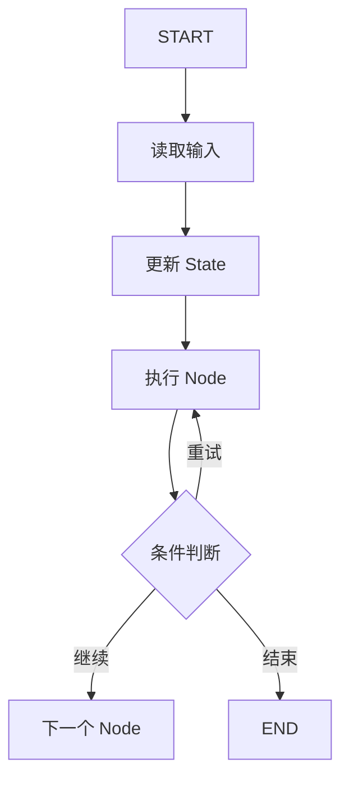

# 从 LangGraph 理解 Agent 流程：State、Node、Edge 与条件路由

理解 DeepAgents，一个很有效的入口不是先记 API，而是先把它看成一张会运行的流程图。LangGraph 把 Agent 运行时拆成了几个非常稳定的元素：`State` 负责携带上下文，`Node` 负责执行一步动作，`Edge` 负责定义流向，条件路由负责在运行时决定下一步去哪。

从这个视角看，DeepAgents 并不神秘。它本质上是在 LangGraph 这类“可持久化状态图运行时”之上，把复杂任务拆解、工具调用、循环执行、失败恢复这些模式工程化了。只要你先看懂 LangGraph 的图模型，再看 DeepAgents，就不会把 Agent 误解成“一次 prompt 调用加几个工具”。

## 一、先把 Agent 画成一张图

先看一个最小心智模型：



这张图里每个元素都对应 LangGraph 的核心概念：

- `State`：整张图共享的运行状态，保存输入、计划、中间结果、错误信息、重试次数等。
- `Node`：一个可执行步骤，比如分类、检索、调用工具、生成草稿、校验结果。
- `Edge`：从一个节点流向另一个节点的连接关系。
- 条件路由：根据当前 `State` 的值，在多个 `Edge` 里选出下一条。

如果把传统脚本理解成“按顺序写死的一串函数调用”，那么 LangGraph 更像“状态驱动的流程控制器”。

## 二、`StateGraph` 到底是什么

LangGraph 最核心的类型通常就是：

```python
from langgraph.graph import StateGraph
```

你可以把 `StateGraph(State)` 理解成一句话：

> “定义一个以 `State` 为唯一真相来源的执行图。”

图里的每个节点都接收当前状态，返回一部分状态更新；LangGraph 再把这些更新合并回全局状态。于是 Agent 不再靠隐式变量和临时对象维持上下文，而是把“当前任务进行到哪一步”这件事显式化。

一个非常小的状态定义可能长这样：

```python
import operator
from typing import Annotated
from typing_extensions import TypedDict


class TaskState(TypedDict):
    request: str
    plan: list[str]
    attempts: int
    status: str
    logs: Annotated[list[str], operator.add]
```

这里有两个关键点：

1. `State` 不是数据库模型，而是“当前运行线程的工作内存”。
2. `Annotated[..., operator.add]` 这样的 reducer 表示某些字段更新时不是覆盖，而是累加。

`logs` 这个字段就很适合做累加。每个节点只返回自己新增的一段日志，最后会合并成完整执行轨迹。

## 三、状态对象怎么设计才对

很多人第一次写 LangGraph，会把 `State` 写成一个“什么都塞进去的大字典”。这会很快失控。更稳妥的做法是把状态分成几类：

| 状态类型 | 典型字段 | 作用 |
| --- | --- | --- |
| 输入数据 | `request` | 用户原始任务 |
| 中间产物 | `plan`、`context`、`draft` | 各节点生成的半成品 |
| 控制信号 | `route`、`status`、`validation_passed` | 控制下一条边怎么走 |
| 错误与恢复 | `last_error`、`attempts`、`max_revision_attempts` | 支持重试、降级、恢复 |
| 观测信息 | `logs` | 便于调试和审计 |

设计状态时，建议遵守 4 条规则：

### 1. 存原始数据，不存拼好的 prompt

更好的做法是把 `context` 存成列表，把 `classification` 存成结构化对象，把 `draft` 存成纯结果。真正发给模型的 prompt 在节点内部按需拼装。

这样做的好处是：

- 同一份状态可以被不同节点以不同方式消费。
- 你改 prompt 模板时，不需要改状态结构。
- 调试时更容易看出“节点收到的原材料”和“节点内部格式化后的输入”。

### 2. 把“业务结果”和“流程控制”分开

比如：

- `draft` 是业务结果
- `validation_passed` 是流程控制信号
- `attempts` 是恢复机制需要的控制字段

如果这些东西混在一坨字符串里，后面的条件路由就会越来越脆弱。

### 3. 明确哪些字段会跨节点增长

像 `logs`、`messages`、`completed_sections` 这种字段，通常不是替换，而是追加。LangGraph 的 reducer 机制就是为这种场景准备的。

### 4. 分清检查点状态和长期记忆

`State` 属于当前线程。它适合保存本轮任务的短期运行上下文。跨线程、跨会话、跨任务的长期信息，应该进入 store 或你自己的外部存储，而不是一股脑塞进 `State`。

## 四、Node 不是“随便写个函数”，而是职责边界

在 LangGraph 里，节点通常就是普通函数：

```python
def build_plan(state: TaskState) -> dict:
    return {"plan": ["拆解问题", "执行任务", "检查结果"]}
```

但工程上真正重要的不是“节点能跑”，而是“节点边界划得对不对”。

一个好节点通常只做一件事：

- 分类节点只负责判断任务类型
- 检索节点只负责补上下文
- 执行节点只负责产出结果
- 校验节点只负责判断结果能不能进入下一步

这样拆的好处很直接：

- 更容易测试，每个节点都能单测
- 更容易观察，你能清楚看到失败发生在哪一步
- 更容易配置不同重试策略，不同节点失败模式不同
- 更容易恢复，因为检查点通常发生在节点边界

如果一个节点内部又检索、又推理、又写库、又发通知，那它一旦失败，恢复成本和调试成本都会明显上升。

## 五、Edge 才是 Agent 的控制流

LangGraph 的图控制主要靠两种边：

### 1. 顺序边：固定下一步

```python
builder.add_edge("classify_request", "build_plan")
```

这表示只要 `classify_request` 运行完，就一定进入 `build_plan`。

### 2. 条件边：运行时决定下一步

```python
builder.add_conditional_edges(
    "review_result",
    route_after_review,
    {
        "done": "mark_done",
        "retry": "execute_task",
        "fallback": "fallback_response",
    },
)
```

这里的 `route_after_review(state)` 会读取当前状态，返回一个路由标签；LangGraph 再根据映射表决定跳到哪个节点。

这就是 Agent 和固定 workflow 的分水岭之一：**图结构是静态定义的，但具体走哪条路是状态驱动的。**

## 六、循环、重试和 `END` 是怎么工作的

很多读者第一次接触 LangGraph 时会问：图不是流程图吗，为什么它能像 Agent 一样反复尝试？

答案就是：**回边。**

```python
builder.add_conditional_edges(
    "review_result",
    route_after_review,
    {
        "retry": "execute_task",
        "done": "mark_done",
        "fallback": "fallback_response",
    },
)
```

当 `review_result` 返回 `retry` 时，图会重新回到 `execute_task`。这就是循环执行。只不过它不是 `while True` 写在代码里，而是被显式画成了一条图上的回边。

而结束也不是“函数 return 了就算完”，而是进入 `END`：

```python
from langgraph.graph import START, END

builder.add_edge("mark_done", END)
builder.add_edge("fallback_response", END)
```

这使得“正常完成”和“降级完成”都能成为清晰、可观测的终点。

## 七、完整示例：一个带条件分支和重试逻辑的任务执行图

下面这段代码故意不用真实外部 API，而是用一个可控的“假执行器”来演示控制流。这样你能把注意力放在 LangGraph 本身，而不是模型接入细节上。

这个图包含 3 类控制：

- 规划后的条件分支：调研类任务先补上下文，再执行
- 节点级自动重试：执行节点遇到瞬时超时，自动按 `RetryPolicy` 重试
- 图级业务重试：结果校验不通过，就沿回边再执行一轮

```python
from __future__ import annotations

import operator
from typing import Annotated, Literal

from typing_extensions import TypedDict

from langgraph.checkpoint.memory import InMemorySaver
from langgraph.graph import END, START, StateGraph
from langgraph.types import RetryPolicy


TRANSIENT_FAILURES: dict[str, int] = {}


class TaskState(TypedDict):
    request: str
    route: Literal["research", "direct"]
    plan: list[str]
    context: list[str]
    draft: str
    attempts: int
    max_revision_attempts: int
    validation_passed: bool
    last_error: str | None
    status: Literal["pending", "running", "done", "fallback"]
    logs: Annotated[list[str], operator.add]


def classify_request(state: TaskState) -> dict:
    request = state["request"]
    keywords = ("调研", "比较", "总结", "背景")
    route: Literal["research", "direct"] = (
        "research" if any(word in request for word in keywords) else "direct"
    )
    return {
        "route": route,
        "status": "running",
        "logs": [f"classify_request -> route={route}"],
    }


def build_plan(state: TaskState) -> dict:
    if state["route"] == "research":
        plan = ["拆解问题", "补充上下文", "执行初稿", "结果校验"]
    else:
        plan = ["直接执行", "结果校验"]

    return {
        "plan": plan,
        "logs": [f"build_plan -> steps={len(plan)}"],
    }


def route_after_planning(state: TaskState) -> Literal["research", "direct"]:
    return "research" if state["route"] == "research" else "direct"


def gather_context(state: TaskState) -> dict:
    context = [
        "LangGraph 用 StateGraph 把状态、节点和边组织成可执行图。",
        "条件路由通过 add_conditional_edges(...) 在运行时选择下一步。",
        "检查点让线程级状态可以在中断、失败后恢复。",
    ]
    return {
        "context": context,
        "logs": [f"gather_context -> collected={len(context)}"],
    }


def run_unstable_worker(task_id: str) -> None:
    seen = TRANSIENT_FAILURES.get(task_id, 0)
    if seen == 0:
        TRANSIENT_FAILURES[task_id] = 1
        raise TimeoutError("mock timeout on first execution")


def execute_task(state: TaskState) -> dict:
    task_id = state["request"]
    run_unstable_worker(task_id)

    attempt_no = state["attempts"] + 1

    if attempt_no == 1:
        draft = "初稿：给出了方向，但还没有形成最终结论。"
    elif state["route"] == "research":
        draft = (
            "最终结论：先补上下文再执行，能显著提升复杂任务的稳定性。"
            f" 本次参考了 {len(state['context'])} 条上下文。"
        )
    else:
        draft = "最终结论：这是一个可直接完成的简单任务。"

    return {
        "draft": draft,
        "attempts": attempt_no,
        "last_error": None,
        "logs": [f"execute_task -> business_attempt={attempt_no}"],
    }


def review_result(state: TaskState) -> dict:
    passed = "最终结论" in state["draft"]
    last_error = None if passed else "缺少最终结论，需要再执行一轮。"

    return {
        "validation_passed": passed,
        "last_error": last_error,
        "logs": [f"review_result -> passed={passed}"],
    }


def route_after_review(state: TaskState) -> Literal["done", "retry", "fallback"]:
    if state["validation_passed"]:
        return "done"
    if state["attempts"] < state["max_revision_attempts"]:
        return "retry"
    return "fallback"


def fallback_response(state: TaskState) -> dict:
    return {
        "status": "fallback",
        "draft": (
            "进入降级流程："
            f" 已执行 {state['attempts']} 次。"
            f" 最后一次校验信息：{state['last_error']}"
        ),
        "logs": ["fallback_response -> degraded"],
    }


def mark_done(state: TaskState) -> dict:
    return {
        "status": "done",
        "logs": ["mark_done -> END"],
    }


builder = StateGraph(TaskState)

builder.add_node("classify_request", classify_request)
builder.add_node("build_plan", build_plan)
builder.add_node("gather_context", gather_context)
builder.add_node(
    "execute_task",
    execute_task,
    retry_policy=RetryPolicy(max_attempts=2, retry_on=TimeoutError),
)
builder.add_node("review_result", review_result)
builder.add_node("fallback_response", fallback_response)
builder.add_node("mark_done", mark_done)

builder.add_edge(START, "classify_request")
builder.add_edge("classify_request", "build_plan")

builder.add_conditional_edges(
    "build_plan",
    route_after_planning,
    {
        "research": "gather_context",
        "direct": "execute_task",
    },
)

builder.add_edge("gather_context", "execute_task")
builder.add_edge("execute_task", "review_result")

builder.add_conditional_edges(
    "review_result",
    route_after_review,
    {
        "done": "mark_done",
        "retry": "execute_task",
        "fallback": "fallback_response",
    },
)

builder.add_edge("mark_done", END)
builder.add_edge("fallback_response", END)

graph = builder.compile(checkpointer=InMemorySaver())


if __name__ == "__main__":
    config = {"configurable": {"thread_id": "task-demo-001"}}

    initial_state: TaskState = {
        "request": "请先调研背景，再给出关于 LangGraph 控制流的结论",
        "route": "direct",
        "plan": [],
        "context": [],
        "draft": "",
        "attempts": 0,
        "max_revision_attempts": 3,
        "validation_passed": False,
        "last_error": None,
        "status": "pending",
        "logs": [],
    }

    final_state = graph.invoke(initial_state, config=config)

    print("status:", final_state["status"])
    print("attempts:", final_state["attempts"])
    print("draft:", final_state["draft"])
    print("logs:")
    for line in final_state["logs"]:
        print(" -", line)
```

## 八、逐步拆解这段图是怎么跑起来的

### 1. `START -> classify_request -> build_plan`

前两步是固定顺序边：

- 先读请求，判断任务是 `research` 还是 `direct`
- 再根据路线生成计划

这就是最基础的 `add_edge(...)`：**没有分支，执行完就去下一步。**

### 2. `build_plan` 后的条件边决定是否先补上下文

这里第一次出现真正的路由：

```python
builder.add_conditional_edges(
    "build_plan",
    route_after_planning,
    {
        "research": "gather_context",
        "direct": "execute_task",
    },
)
```

如果当前任务需要调研，就先经过 `gather_context`；如果是简单任务，就直接进入执行节点。  
这类分支就是 LangGraph 最典型的 Agent 控制模式之一：**同一张图，因状态不同而走不同路径。**

### 3. `execute_task` 里的重试有两层

这段示例最值得区分的是两种“重试”：

#### 第一层：节点级自动重试

```python
builder.add_node(
    "execute_task",
    execute_task,
    retry_policy=RetryPolicy(max_attempts=2, retry_on=TimeoutError),
)
```

这里处理的是**瞬时执行故障**，比如超时、网络抖动、短暂锁冲突。节点第一次抛 `TimeoutError` 后，LangGraph 会在节点内部自动再试一次。

这类重试的特点是：

- 对图结构透明
- 不需要显式回边
- 更像“基础设施级恢复”

#### 第二层：图级业务重试

即使节点技术上执行成功，结果也可能业务上不合格。示例里第一次成功执行时，故意只产出“初稿”，没有“最终结论”，所以校验会失败：

- `execute_task` 成功返回
- `review_result` 发现结果不达标
- 条件边把流程重新路由回 `execute_task`

这类重试的特点是：

- 是图上显式可见的回边
- 条件来自业务状态，不是异常类型
- 适合处理“结果不好，需要再来一轮”的 Agent 场景

这也是 LangGraph 很适合 Agent 的原因：**技术失败和业务失败可以用两套机制处理。**

### 4. `review_result` 是循环的关口

`review_result` 干的事只有一件：把结果变成可路由的信号。

```python
def route_after_review(state: TaskState) -> Literal["done", "retry", "fallback"]:
    if state["validation_passed"]:
        return "done"
    if state["attempts"] < state["max_revision_attempts"]:
        return "retry"
    return "fallback"
```

这一步特别像状态机里的“转移函数”：

- 满足条件就 `done`
- 还能再试就 `retry`
- 超过阈值就 `fallback`

于是循环、退出、降级都不再是分散在各个函数里的 `if/else`，而是集中体现在图的路由层。

### 5. `END` 不是语法结束，而是流程结束

图里真正的终点是：

- `mark_done -> END`
- `fallback_response -> END`

这意味着：

- 成功完成是一种结束
- 降级完成也是一种结束

当你的系统以后接入监控、审计、可视化时，这种显式终点会非常重要。你能清楚区分“任务成功收敛”和“任务进入兜底收敛”。

## 九、检查点持久化：为什么 `compile(checkpointer=...)` 很关键

如果只把 LangGraph 当成“会跑图的库”，你会低估它。它真正适合 Agent 的地方，在于**状态可以按线程持久化**。

示例里编译图时用了：

```python
graph = builder.compile(checkpointer=InMemorySaver())
```

运行时又传了：

```python
config = {"configurable": {"thread_id": "task-demo-001"}}
```

这两个东西组合起来，含义是：

- `checkpointer` 决定状态快照保存到哪里
- `thread_id` 决定当前执行属于哪条线程

于是 LangGraph 可以围绕这条线程保留检查点，支持：

- 多轮连续执行
- 中断后的恢复
- 失败后的重跑
- 某一步出错时从最近节点边界继续

对这件事要有两个工程判断：

### 1. `InMemorySaver()` 只适合演示和本地调试

它保存在内存里，进程一重启就没了。真正需要持久化时，应该换成持久化后端，比如本地文件或数据库型 checkpointer。

### 2. 检查点是短期线程状态，不是长期知识库

它适合保存“这次任务目前做到哪一步”。  
用户偏好、共享知识、跨任务记忆这些长期数据，不应该直接依赖 checkpointer，而应该放在 store 或外部存储中。

## 十、从这张图回看 DeepAgents，你会更容易理解什么

当你已经能把上面的示例看成一张状态图，再看 DeepAgents，很多概念会自动落地：

- 任务拆解，本质上是某些节点在生成下一阶段可执行状态
- 工具调用，本质上是某些节点在借助外部能力更新状态
- 反思与重试，本质上是校验节点把流程重新路由回前面的执行节点
- 长任务恢复，本质上依赖检查点和线程化状态持久化

也就是说，DeepAgents 的“复杂”，更多是业务层复杂，不是运行时模型神秘。它底层仍然是：

1. 读取状态
2. 执行节点
3. 更新状态
4. 选择边
5. 直到进入 `END`

## 十一、写 LangGraph 时最常见的 5 个坑

### 1. 把 `State` 当临时杂物箱

状态字段一旦失控，后面的路由条件和节点职责都会变得模糊。

### 2. 节点太大

节点越大，失败后越难恢复；而且不同步骤的重试策略也没法分开配。

### 3. 业务重试和异常重试不分

瞬时超时应该交给 `RetryPolicy`。  
结果不满意、信息不足、工具回包不完整，则应该通过条件边显式回环。

### 4. 只关注“能不能跑通”，不关注“为什么这样流转”

如果你无法从图上解释“为什么从 A 到 B”，后续维护时几乎一定会变乱。

### 5. 把检查点当长期记忆

检查点解决的是线程内连续性，不是用户长期知识沉淀。

## 十二、总结

从 LangGraph 理解 Agent，最重要的是把它重新想成一张“状态驱动流程图”：

- `State` 是运行时唯一真相来源
- `Node` 是最小职责单元
- `Edge` 是控制流
- 条件路由决定 Agent 在运行时如何分支、循环和收敛
- `END` 让结束路径显式化
- `checkpointer + thread_id` 让图变成可恢复的运行时，而不是一次性脚本

你一旦建立这个视角，再往上看 DeepAgents，就会更容易理解为什么它强调任务分解、重试恢复、持久化执行和多步骤控制。因为这些能力本来就不是靠“更长的 prompt”长出来的，而是靠**状态、节点、边和路由**这套运行机制长出来的。

## 参考资料

- LangGraph Thinking in LangGraph: https://docs.langchain.com/oss/python/langgraph/thinking-in-langgraph
- LangGraph Workflows and Agents: https://docs.langchain.com/oss/python/langgraph/workflows-agents
- LangGraph Persistence: https://docs.langchain.com/oss/python/langgraph/persistence
